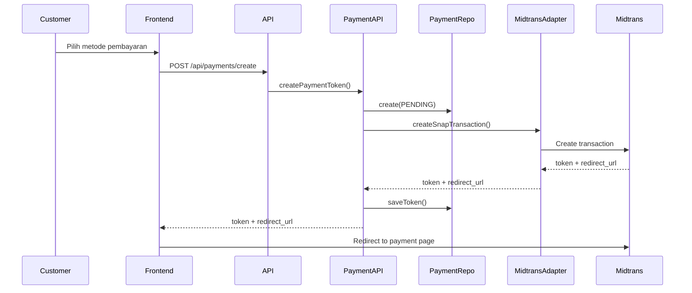
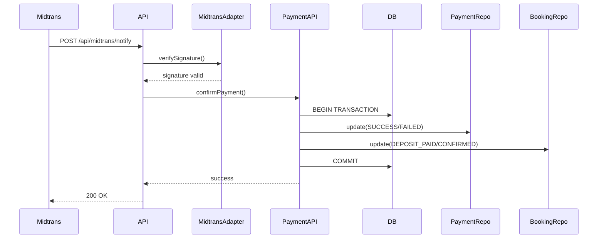
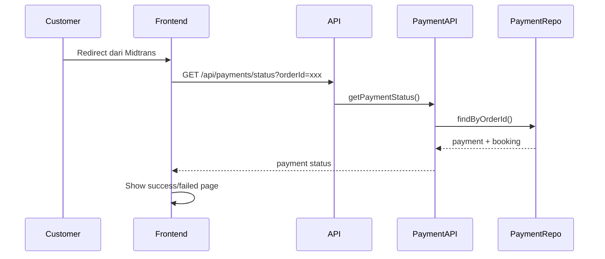

# Midtrans Payment Gateway Setup

Dokumentasi lengkap untuk setup dan konfigurasi Midtrans payment gateway di aplikasi MyHome.

## 📋 Daftar Isi

1. [Arsitektur](#arsitektur)
2. [Environment Variables](#environment-variables)
3. [Konfigurasi Midtrans Dashboard](#konfigurasi-midtrans-dashboard)
4. [Flow Pembayaran](#flow-pembayaran)
5. [API Endpoints](#api-endpoints)
6. [Testing](#testing)
7. [Troubleshooting](#troubleshooting)

## 🏗️ Arsitektur

Implementasi Midtrans mengikuti arsitektur 3-tier:

### Tier-1: Presentation Layer
- **API Routes**: `app/api/payments/`, `app/api/midtrans/`
- **Pages**: `app/(public-pages)/payment/`

### Tier-2: Application Layer
- **Payment API**: `server/api/payment.api.ts`
- Orchestrates payment operations

### Tier-3: Domain & Infrastructure
- **Services**: `server/services/payment.service.ts` (business logic)
- **Repositories**: `server/repositories/payment.repository.ts` (data access)
- **Adapters**: `server/adapters/midtrans/` (external integration)

## 🔐 Environment Variables

Tambahkan ke file `.env.local`:

```env
# Midtrans Configuration
MIDTRANS_SERVER_KEY="Mid-server-xxxxxxxxxxxxx"
MIDTRANS_CLIENT_KEY="Mid-client-xxxxxxxxxxxxx"
MIDTRANS_IS_PRODUCTION="false"

# Application Base URL
APP_BASE_URL="http://localhost:3000"
```

### Mendapatkan Credentials

1. **Sandbox (Development)**:
   - Login ke [Midtrans Dashboard Sandbox](https://dashboard.sandbox.midtrans.com/)
   - Pergi ke **Settings** → **Access Keys**
   - Copy **Server Key** dan **Client Key**

2. **Production**:
   - Login ke [Midtrans Dashboard Production](https://dashboard.midtrans.com/)
   - Pergi ke **Settings** → **Access Keys**
   - Copy **Server Key** dan **Client Key**
   - Set `MIDTRANS_IS_PRODUCTION="true"`

## ⚙️ Konfigurasi Midtrans Dashboard

### 1. Snap Preferences

Pergi ke **Settings** → **Snap Preferences**:

#### Redirect URLs

Set URL berikut (ganti `APP_BASE_URL` dengan domain Anda):

- **Finish URL**: `https://yourdomain.com/payment/success`
- **Unfinish URL**: `https://yourdomain.com/payment/failed?reason=unfinish`
- **Error URL**: `https://yourdomain.com/payment/failed?reason=error`

Untuk development (localhost):
- **Finish URL**: `http://localhost:3000/payment/success`
- **Unfinish URL**: `http://localhost:3000/payment/failed?reason=unfinish`
- **Error URL**: `http://localhost:3000/payment/failed?reason=error`

#### Payment Methods

Aktifkan metode pembayaran yang diinginkan:
- ✅ Credit Card
- ✅ Bank Transfer (BCA, BNI, BRI, Permata, Mandiri)
- ✅ E-Wallet (GoPay, ShopeePay, QRIS)
- ✅ Convenience Store (Indomaret, Alfamart)

### 2. Notification URL (Webhook)

Pergi ke **Settings** → **Configuration**:

- **Payment Notification URL**: `https://yourdomain.com/api/midtrans/notify`

Untuk development (localhost), gunakan **ngrok** atau **localtunnel**:

```bash
# Install ngrok
npm install -g ngrok

# Start ngrok
ngrok http 3000

# Copy HTTPS URL (e.g., https://abc123.ngrok.io)
# Set Notification URL: https://abc123.ngrok.io/api/midtrans/notify
```

### 3. Security Settings

- ✅ Enable **3D Secure** untuk Credit Card
- ✅ Enable **Fraud Detection**
- ✅ Set **Allowed Origins** (untuk CORS):
  - Development: `http://localhost:3000`
  - Production: `https://yourdomain.com`

## 💳 Flow Pembayaran

### 1. Create Payment Token



### 2. Payment Notification (Webhook)



### 3. Payment Status Check



## 🔌 API Endpoints

### POST /api/payments/create

Create payment token untuk booking.

**Request:**
```json
{
  "bookingId": "clxxx...",
  "paymentType": "DEPOSIT" | "FULL"
}
```

**Response:**
```json
{
  "success": true,
  "data": {
    "token": "xxx-xxx-xxx",
    "redirectUrl": "https://app.sandbox.midtrans.com/snap/v3/...",
    "orderId": "DEP-CLXXX-ABC123"
  }
}
```

### POST /api/midtrans/notify

Webhook endpoint untuk notifikasi dari Midtrans.

**Request (dari Midtrans):**
```json
{
  "order_id": "DEP-CLXXX-ABC123",
  "status_code": "200",
  "gross_amount": "500000.00",
  "signature_key": "xxx...",
  "transaction_status": "settlement",
  "transaction_time": "2024-01-01 12:00:00",
  "transaction_id": "xxx",
  "payment_type": "bank_transfer"
}
```

**Response:**
```json
{
  "success": true,
  "message": "Notification received and processed"
}
```

### GET /api/payments/status

Get payment status by order ID.

**Query Params:**
- `orderId`: Midtrans order ID

**Response:**
```json
{
  "success": true,
  "data": {
    "payment": {
      "id": "clxxx...",
      "status": "SUCCESS",
      "amount": 500000,
      ...
    },
    "booking": {
      "id": "clxxx...",
      "status": "DEPOSIT_PAID",
      ...
    }
  }
}
```

## 🧪 Testing

### 1. Test Cards (Sandbox)

Midtrans menyediakan test cards untuk testing:

**Success:**
- Card Number: `4811 1111 1111 1114`
- CVV: `123`
- Exp: `01/25`

**Failure:**
- Card Number: `4911 1111 1111 1113`
- CVV: `123`
- Exp: `01/25`

### 2. Test Virtual Account

**BCA VA:**
- VA Number akan di-generate otomatis
- Gunakan simulator di Midtrans Dashboard

### 3. Manual Testing Flow

1. **Create Booking**:
   ```bash
   POST /api/bookings
   ```

2. **Create Payment**:
   ```bash
   POST /api/payments/create
   {
     "bookingId": "xxx",
     "paymentType": "DEPOSIT"
   }
   ```

3. **Simulate Payment** di Midtrans Dashboard:
   - Pergi ke **Transactions**
   - Cari order ID
   - Klik **Actions** → **Set Status**
   - Pilih **Settlement**

4. **Check Webhook** di logs:
   ```bash
   # Terminal logs akan menampilkan:
   Midtrans notification received: { orderId: 'xxx', ... }
   Payment confirmed successfully: { ... }
   ```

5. **Verify Database**:
   ```sql
   SELECT * FROM "Payment" WHERE "midtransOrderId" = 'xxx';
   SELECT * FROM "Booking" WHERE id = 'xxx';
   ```

## 🐛 Troubleshooting

### Webhook tidak diterima

**Penyebab:**
- Notification URL salah
- Localhost tidak accessible dari internet

**Solusi:**
1. Gunakan ngrok untuk expose localhost
2. Pastikan Notification URL di Midtrans Dashboard benar
3. Check firewall/security settings

### Signature verification failed

**Penyebab:**
- Server Key salah
- Payload dari Midtrans berubah

**Solusi:**
1. Verify Server Key di `.env.local`
2. Check logs untuk melihat signature calculation
3. Pastikan menggunakan SHA512

### Payment status tidak update

**Penyebab:**
- Webhook gagal
- Transaction error di database

**Solusi:**
1. Check webhook logs
2. Verify database transaction
3. Manual trigger notification dari Midtrans Dashboard

### Redirect URL tidak bekerja

**Penyebab:**
- APP_BASE_URL salah
- Redirect URL di Midtrans Dashboard salah

**Solusi:**
1. Verify `APP_BASE_URL` di `.env.local`
2. Check Snap Preferences di Midtrans Dashboard
3. Pastikan URL accessible

## 📚 Resources

- [Midtrans Documentation](https://docs.midtrans.com/)
- [Snap Integration Guide](https://docs.midtrans.com/en/snap/overview)
- [Notification Handling](https://docs.midtrans.com/en/after-payment/http-notification)
- [Testing Payment](https://docs.midtrans.com/en/technical-reference/sandbox-test)

## 🔒 Security Checklist

- ✅ Server Key tidak pernah di-expose ke client
- ✅ Signature verification untuk semua webhook
- ✅ HTTPS untuk production
- ✅ Environment variables di-secure
- ✅ Transaction idempotency
- ✅ Input validation dengan Zod
- ✅ Error handling yang proper

