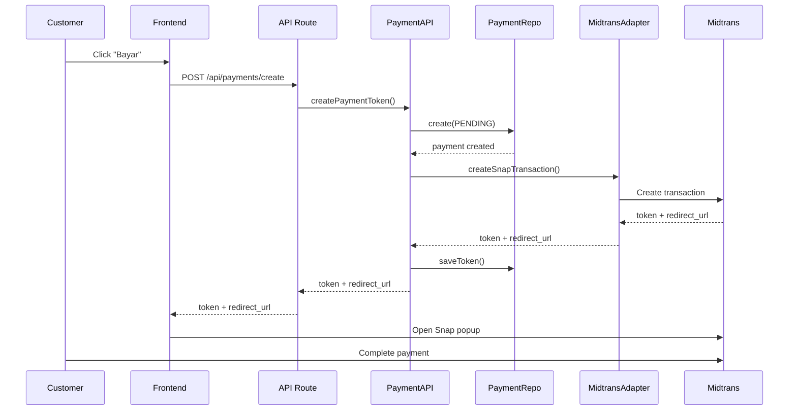
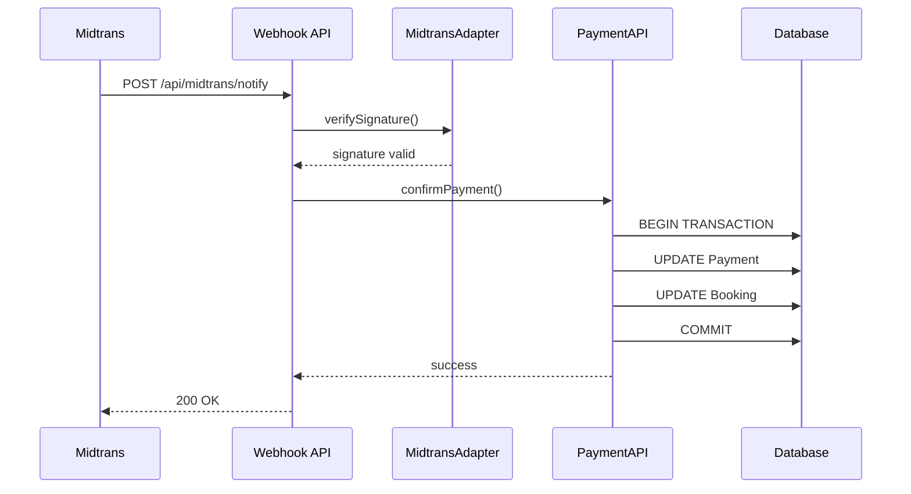
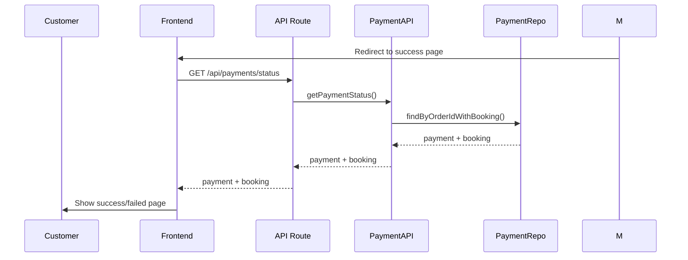

# Payment System Overview

Dokumentasi lengkap sistem pembayaran Midtrans di aplikasi MyHome.

## 📚 Dokumentasi Terkait

1. **[MIDTRANS_SETUP.md](./MIDTRANS_SETUP.md)** - Setup dan konfigurasi Midtrans
2. **[PAYMENT_INTEGRATION_EXAMPLE.md](./PAYMENT_INTEGRATION_EXAMPLE.md)** - Contoh implementasi di frontend

## 🏗️ Arsitektur

### 3-Tier Architecture

```
┌─────────────────────────────────────────────────────────────┐
│                    TIER 1: Presentation                      │
│  ┌──────────────────────┐  ┌──────────────────────────────┐ │
│  │   API Routes         │  │   Pages                      │ │
│  │   /api/payments/     │  │   /payment/success           │ │
│  │   /api/midtrans/     │  │   /payment/failed            │ │
│  └──────────────────────┘  └──────────────────────────────┘ │
└─────────────────────────────────────────────────────────────┘
                              ↓
┌─────────────────────────────────────────────────────────────┐
│                  TIER 2: Application                         │
│  ┌──────────────────────────────────────────────────────┐   │
│  │   Payment API (payment.api.ts)                       │   │
│  │   - createPaymentToken()                             │   │
│  │   - confirmPayment()                                 │   │
│  │   - getPaymentStatus()                               │   │
│  └──────────────────────────────────────────────────────┘   │
└─────────────────────────────────────────────────────────────┘
                              ↓
┌─────────────────────────────────────────────────────────────┐
│              TIER 3: Domain & Infrastructure                 │
│  ┌──────────────┐  ┌──────────────┐  ┌──────────────────┐  │
│  │   Services   │  │ Repositories │  │    Adapters      │  │
│  │   payment.   │  │   payment.   │  │   midtrans/      │  │
│  │   service.ts │  │   repo.ts    │  │   snap.adapter   │  │
│  └──────────────┘  └──────────────┘  └──────────────────┘  │
└─────────────────────────────────────────────────────────────┘
```

## 📁 Struktur File

```
src/
├── app/
│   ├── api/
│   │   ├── payments/
│   │   │   ├── create/route.ts          # Create payment token
│   │   │   └── status/route.ts          # Get payment status
│   │   └── midtrans/
│   │       └── notify/route.ts          # Webhook notification
│   └── (public-pages)/
│       └── payment/
│           ├── success/page.tsx         # Success page
│           ├── failed/page.tsx          # Failed page
│           └── pending/page.tsx         # Pending page
│
├── server/
│   ├── api/
│   │   └── payment.api.ts               # Application service
│   ├── services/
│   │   └── payment.service.ts           # Domain logic
│   ├── repositories/
│   │   ├── payment.repository.ts        # Data access
│   │   └── booking.repository.ts        # Booking data access
│   ├── adapters/
│   │   └── midtrans/
│   │       ├── snap.adapter.ts          # Midtrans integration
│   │       └── index.ts                 # Exports
│   ├── schemas/
│   │   └── booking.schemas.ts           # Zod validation
│   └── types/
│       └── booking.ts                   # TypeScript types
│
├── components/
│   └── payment/
│       └── payment-button.tsx           # Reusable payment button
│
└── lib/
    └── utils.ts                         # Utility functions
```

## 🔄 Payment Flow

### 1. Create Payment



### 2. Payment Notification



### 3. Status Check



## 💾 Database Schema

### Payment Table

```prisma
model Payment {
  id               String        @id @default(cuid())
  bookingId        String
  userId           String
  midtransOrderId  String        @unique
  paymentType      PaymentType   // DEPOSIT | FULL
  paymentMethod    String?
  amount           Decimal
  status           PaymentStatus // PENDING | SUCCESS | FAILED | EXPIRED
  transactionTime  DateTime?
  transactionId    String?
  paymentToken     String?
  expiryTime       DateTime?
  createdAt        DateTime      @default(now())
  updatedAt        DateTime      @updatedAt

  booking          Booking       @relation(...)
  user             User          @relation(...)
}
```

### Booking Table

```prisma
model Booking {
  id             String        @id @default(cuid())
  bookingCode    String        @unique
  userId         String
  propertyId     String
  roomId         String
  checkInDate    DateTime
  checkOutDate   DateTime?
  leaseType      LeaseType
  totalAmount    Decimal
  depositAmount  Decimal?
  paymentStatus  PaymentStatus // PENDING | SUCCESS | FAILED | EXPIRED
  status         BookingStatus // UNPAID | DEPOSIT_PAID | CONFIRMED | ...
  createdAt      DateTime      @default(now())
  updatedAt      DateTime      @updatedAt

  payments       Payment[]
  // ... other relations
}
```

## 🔐 Status Mapping

### Payment Status Flow

```
PENDING → SUCCESS (settlement/capture)
        → FAILED (deny/cancel)
        → EXPIRED (expire)
```

### Booking Status Flow

```
UNPAID → DEPOSIT_PAID (deposit payment success)
       → CONFIRMED (full payment success)
       → EXPIRED (payment expired)
       → CANCELLED (payment failed)
```

### Status Mapping Logic

| Midtrans Status | Payment Status | Booking Status | Booking Payment Status |
|----------------|----------------|----------------|------------------------|
| settlement     | SUCCESS        | DEPOSIT_PAID / CONFIRMED | SUCCESS |
| capture        | SUCCESS        | DEPOSIT_PAID / CONFIRMED | SUCCESS |
| pending        | PENDING        | UNPAID         | PENDING |
| deny           | FAILED         | UNPAID         | FAILED |
| cancel         | FAILED         | UNPAID         | FAILED |
| expire         | EXPIRED        | EXPIRED        | EXPIRED |

## 🔒 Security Features

### 1. Signature Verification

```typescript
// Verify Midtrans notification signature
const signatureString = `${orderId}${statusCode}${grossAmount}${serverKey}`;
const calculatedSignature = sha512(signatureString);
const isValid = calculatedSignature === signatureKey;
```

### 2. Server-Only Secrets

```typescript
// ❌ NEVER expose server key to client
process.env.MIDTRANS_SERVER_KEY // Server-only

// ✅ Client key is safe to expose
process.env.NEXT_PUBLIC_MIDTRANS_CLIENT_KEY // Client-safe
```

### 3. Transaction Safety

```typescript
// Use Prisma transaction for atomic updates
await prisma.$transaction(async (tx) => {
  await tx.payment.update({ ... });
  await tx.booking.update({ ... });
});
```

### 4. Idempotency

```typescript
// Check if payment already processed
if (existingPayment.status !== "PENDING") {
  return ok(existingPayment); // Already processed
}
```

## 📊 Payment Types

### 1. Deposit Payment

- **Type**: `DEPOSIT`
- **Amount**: `booking.depositAmount`
- **Expiry**: 24 hours
- **Result**: Booking status → `DEPOSIT_PAID`

### 2. Full Payment

- **Type**: `FULL`
- **Amount**: 
  - If deposit paid: `totalAmount - depositAmount`
  - If no deposit: `totalAmount`
- **Expiry**: 1 hour
- **Result**: Booking status → `CONFIRMED`

## 🧪 Testing

### Test Cards (Sandbox)

```
Success:
  Card: 4811 1111 1111 1114
  CVV: 123
  Exp: 01/25

Failure:
  Card: 4911 1111 1111 1113
  CVV: 123
  Exp: 01/25
```

### Manual Testing Steps

1. Create booking via API
2. Create payment token
3. Complete payment in Midtrans Snap
4. Verify webhook received
5. Check database updates
6. Verify redirect to success page

## 🚨 Error Handling

### Common Errors

1. **Invalid Signature**
   - Cause: Wrong server key or tampered payload
   - Solution: Verify server key in .env

2. **Payment Already Processed**
   - Cause: Duplicate notification
   - Solution: Idempotency check (already handled)

3. **Booking Not Found**
   - Cause: Invalid booking ID
   - Solution: Validate booking exists before payment

4. **Transaction Failed**
   - Cause: Database error during update
   - Solution: Transaction rollback (automatic)

## 📈 Monitoring

### Logs to Monitor

```typescript
// Payment creation
console.log("Payment token created:", { orderId, bookingId });

// Webhook received
console.log("Midtrans notification received:", { orderId, status });

// Payment confirmed
console.log("Payment confirmed:", { orderId, paymentStatus, bookingStatus });
```

### Metrics to Track

- Payment success rate
- Average payment time
- Failed payment reasons
- Webhook delivery rate

## 🔗 External Resources

- [Midtrans Documentation](https://docs.midtrans.com/)
- [Snap Integration](https://docs.midtrans.com/en/snap/overview)
- [Notification Handling](https://docs.midtrans.com/en/after-payment/http-notification)
- [Testing Guide](https://docs.midtrans.com/en/technical-reference/sandbox-test)

## ✅ Checklist Deployment

- [ ] Set production Midtrans credentials
- [ ] Update `MIDTRANS_IS_PRODUCTION=true`
- [ ] Configure production redirect URLs
- [ ] Set production notification URL
- [ ] Enable HTTPS
- [ ] Test payment flow end-to-end
- [ ] Monitor webhook logs
- [ ] Set up error alerting

